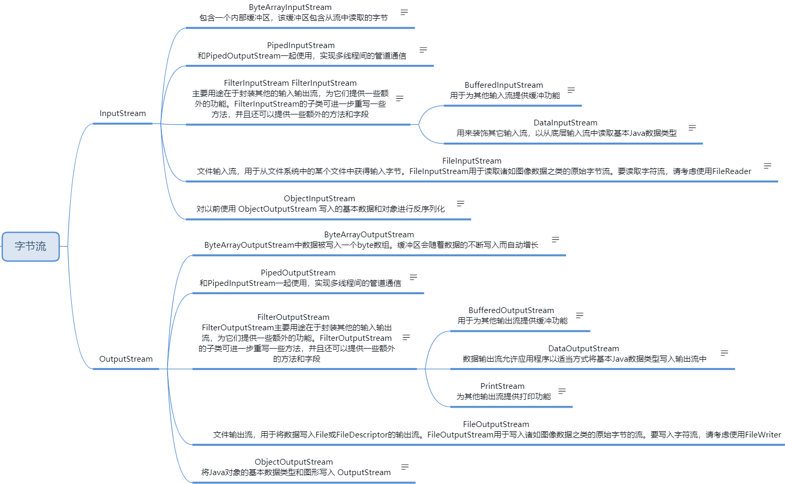
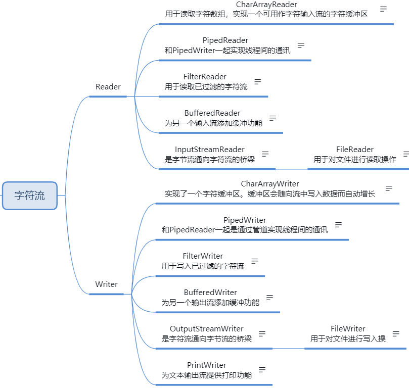

1. File类常用API

```java
public File(String pathname) // File类的构造方法
public boolean createNewFile() throws IOException // 创建文件
public String getName() // 获取文件的名称
public String getAbsolutePath() // 获取文件的绝对路径, 无论当前文件是否存在, 只要给具体的路径, 都可以返回相应的路径名称
public boolean isDirectory() // 判断文件是否是目录
public boolean isFile() // 判断文件是否是文件
public String getParent() // 获取文件的父路径名称, 如果文件的路径只包含文件名称 则显示空
public boolean exists() // 判断当前文件是否存在
public String getCanonicalPath() throws IOException // 返回文件绝对路劲的规范格式
public String[] list() // 返回元素中命名文件和目录的字符串数组
public File[] listFiles() // 返回元素中命名文件和目录的File数组
public static File[] listRoots() // 返回当前文件系统的所有盘符
public boolean mkdir()  // 创建单击目录
public boolean mkdirs() // 创建多级目录
File.separator // File类的静态属性, 返回操作系统的文件分隔符
// 判断文件的属性, 都会返回boolean类型的值
public boolean canExecute()
public boolean canRead()
public boolean canWrite()
```

2. 递归实现循环遍历某个文件夹中所有文件的绝对路径

```java
public static void printFiles(File file) {
    // 如果是目录, 转换为文件数组
    if (file.isDirectory) {
        File[] files = file.isListFile();
        // 使用增强for循环, 遍历目录下的子文件
        for (File f : files) {
            // 递归调用
            printFiles(f);
        }
        // 如果不是目录, 打印文件绝对路径
    } else {
        System.out.println(file.getAbsolutePath());
    }
}
// 文件在遍历的时候, 如果系统受保护, 某些文件没有访问权限, 此时会出现空指针异常
```

3. IO流的原理和概念

   - 按流向划分, 以程序作为参照物:

   - 从一个文件中读取数据到程序叫做输入流, read读输入流
   - 从程序输出数据到另一个文件叫做输出流, write写输出流
4. 按处理单元划分, 纯文本的是否可以用16位Unicode字符流Reader或Writer; 图片和视频等必须用8位通用字节流InputStream和OutputStream
5. 当编写IO流的程序的时候一定要注意关闭流
   - 选择合适的IO流对象
   - 创建对象
   - 传输数据
   - 关闭流对象, 不关闭会一直占用系统资源
6. 什么时候需要flush, 什么时候不加flush?
   - 当某一个输出流对象中带有缓冲区的时候, 就需要进行flush, 在输出流关闭之前每次都flush

7. 流的分类?

   - 功能不同
     - 节点流: 可以字节从数据源或目的地读写数据
     - 处理流(包装流): 不直接连接到数据源或目的地, 是其他流进行封装, 目的主要是简化操作和提高性能

   - 节点流和处理流的关系
     - 节点流处于IO操作的第一线, 所有操作必须通过他们进行
     - 处理流可以对其他流进行处理(提高效率或操作灵活性)

8. 处理流的使用

```java
FileInputStream fileInputStream = new FileInptStream("abc.txt"); // 节点流
InputStreamReader inputStreamReader = new InputStreamReader(fileInputStream); // 处理流
InputStreamReader inputStreamReader = new InputStreamReader(fileInputStream, "utf-8"); // 处理流, 可以自定义字符编码
```

9. 节点流缓冲区和循环代码

```java
FileInputStream inputStream = new FileInputStream();
byte[] buffer = new byte[];
while((inputStream.read(buffer) != -1) { // read / writer 不等于-1就是读取整个数据循环条件
    new String(buffer);
}
```

10. 输入流和输出流的使用步骤

```java
// 输入流
FileInputStream fileInputStream = null;
try {
    fileInputStream = new FileInputStream("abc.txt");
	int read = 0;
    while ((read = fileInputStream.read) != -1) {
        System.out.println((char) read);
    } catch (Exception e) {
        e.printStackTrace();
    } finally {
        // 关闭字节流
    }
}

// 输出流
File file = new File("aaa.txt");
FileOutputStream fileOutputStream = null;
try {
    fileOutputStream = new FileOutputStream(file);
    fileOutputStream.write("test");
    fileOutputStream.flush();
} catch (Exception e) {
	e.printStackTrace();
} finally {
   	// 关闭字节流   
}
```

11. ObjectInputStream和ObjectOutputStream的注意
    - 如果需要对象通过IO流进行传输, 那么必须要实现序列化接口
    - 当前类中必须声明一个serialVersionUID的值, 值为多少无所谓
    - transient: 使用次关键字修饰的变量, 在进行序列化的时候, 不会被序列化

12. 在控制台边读(输入)编写(输出)实验

```java
package com.java.se.io.test;

import java.io.*;

/**
 * @Author: PeiYiDing
 * @Date: 2020/12/28
 * @Description: com.java.se.io.test
 */
public class ExitTest1 {
    public static void main(String[] args) {
        try (// 输入节点流
             InputStreamReader inputStreamReader = new InputStreamReader(System.in);
             // 输出节点流
             OutputStreamWriter outputStreamWriter = new OutputStreamWriter(System.out);
             // 输入缓冲区处理流
             BufferedReader bufferedReader = new BufferedReader(inputStreamReader);
             // 输出缓冲区处理流
             BufferedWriter bufferedWriter = new BufferedWriter(outputStreamWriter);) {
            String str = "";
            while (!"exit".equals(str)) {
                // 读操作
                str = bufferedReader.readLine();
                // 写操作
                bufferedWriter.write(str);
                // 刷新输出流缓冲区, 使得读一行写一行, 而且数据完整读到输出
                bufferedWriter.flush();
            }
        } catch (IOException e) {
            e.printStackTrace();
        }
    }
}
```

13. 读取百度网址的内容

```java
package com.java.se.io.test;

import java.io.*;
import java.net.URL;

/**
 * @Author: PeiYiDing
 * @Date: 2020/12/28
 * @Description: com.java.se.io.test
 */
public class NetworkTest {
    public static void main(String[] args) {
        // 初始化缓冲字符输入流
        BufferedReader bufferedReader = null;
        // 初始化缓冲字符输出流
        BufferedWriter bufferedWriter = null;
        try {
            // 实例化缓冲字符输入流
            bufferedReader = new BufferedReader(new InputStreamReader(new URL("http://www.baidu.com").openStream(), "utf8"));
            // 实例化缓冲字符输出流
            bufferedWriter = new BufferedWriter(new OutputStreamWriter(new FileOutputStream("baidu.html")));
            
            // 循环判断输入流读操作不为空, 就循环执行输出流写操作 
            String msg = null;
            while ((msg = bufferedReader.readLine()) != null) {
                bufferedWriter.write(msg);
                // 刷新缓冲区
                bufferedWriter.flush();
            }
        } catch (IOException e) {
            e.printStackTrace();
        } finally {
            try {
                bufferedWriter.close();
                bufferedReader.close();
            } catch (IOException e) {
                e.printStackTrace();
            }
        }
    }
}

```

14. 错误输出使用`System.err.println();`

15. `System.out.printf(“”);`格式化输出 %s是以字符串输出, %d是以十进制输出, %f是以小数输出, m.n表示的是总共m位,小数点n位

16. 使用RandomAccessFile类分块读取文件的大小

```JAVA
package com.java.se.io.test;

import java.io.File;
import java.io.FileNotFoundException;
import java.io.IOException;
import java.io.RandomAccessFile;

/**
 * @Author: PeiYiDing
 * @Date: 2020/12/28
 * @Description: com.java.se.io.test
 */
public class RandomAccessFileTest {
    public static void main(String[] args) {
        // 实例化文件对象
        File file = new File("doc.txt");
        // 整个文件的大小
        long length = file.length();
        // 规定块的大小
        int blockSize = 1024;
        // 文件可以被切分成多少个块
        int size = (int) Math.ceil(length * 1.0 / blockSize);
        System.out.printf("要被切成<%d>个块", size);
        // 定义起始偏移量位0
        int beginPos = 0;
        // 如果实际文件大小大于块的大小,就赋值块的大小, 如果小则赋值文件实际大小
        int actualSize = (int) (blockSize > length ? length : blockSize);

        // 循环文件的块数
        for (int i = 0; i < size; i++) {
            // 每次读取块的时候的起始偏移量
            beginPos = i * blockSize;
            // 如果遍历到最后一个块
            if (i == size - 1) {
                // 返回剩余的文件大小
                actualSize = (int) length;
            } else {
                // 每循环一次都按一块1024读
                actualSize = blockSize;
                // 使用文件大小减去已经读过的块的大小, 给最后一块读起到正确的读的作用
                length -= actualSize;
            }
            System.out.println(i + "--->起始位置是: " + beginPos + "--->读取的大小是: " + actualSize);
            //readSplit(i, beginPos, actualSize);
        }
    }

    public static void readSplit(int i, int beginPos, int actualSize) {
        // 声明randomAccessFile对象
        RandomAccessFile randomAccessFile = null;
        try {
            // 实例化对象
            randomAccessFile = new RandomAccessFile(new File("doc.txt"), "r");
            // 表示从哪个偏移量读取数据
            randomAccessFile.seek(beginPos);
            // 实例化一个bytes数组
            byte[] bytes = new byte[1024];
            // 初始化一个length的变量
            int length = 0;
            // 循环文件可读到的内容
            while ((length = randomAccessFile.read(bytes)) != -1) {
                // 如果实际大小大于长度
                if (actualSize > length) {
                    // 把一块1024的内容打印出来, 使用newString(), 带偏移量和长度的
                    System.out.println(new String(bytes, 0, length));
                    // 减去已读的数据长度
                    actualSize -= length;

                    // 如果实际大小大于长度
                } else {
                    // 把实际大小的内容读出来
                    System.out.println(new String(bytes, 0, actualSize));
                    // 读完全部内容后跳出循环
                    break;
                }
            }
        } catch (FileNotFoundException e) {
            e.printStackTrace();
        } catch (IOException e) {
            e.printStackTrace();
        } finally {
            try {
                randomAccessFile.close();
            } catch (IOException e) {
                e.printStackTrace();
            }
        }
    }
}
```

17. IO流总结图

  

 