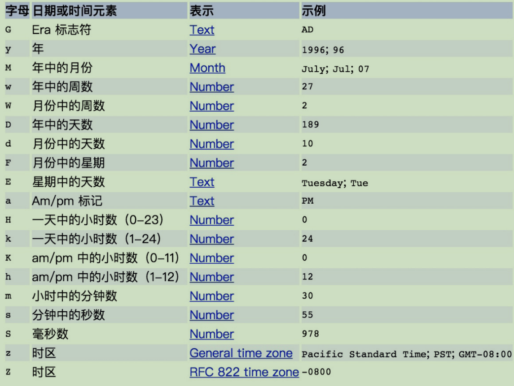
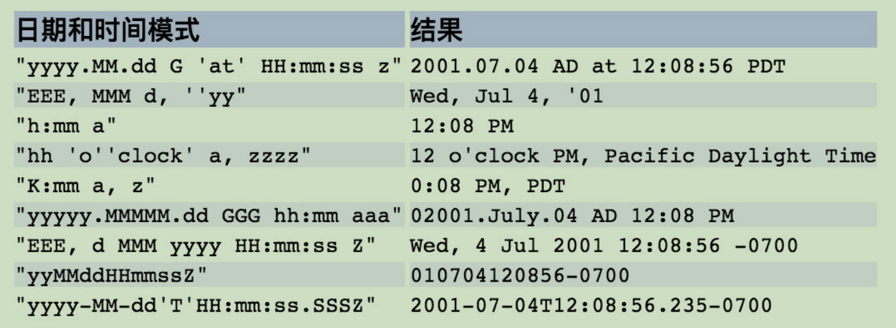

1. 为什么禁止把 SimpleDateFormat 定义成static 变量？
- SimpleDateFormat 主 要 可 以 在  String 和 Date 之间做转换，还可以将时间转换成不同时区输出。同时提到在并发场景中 SimpleDateFormat 是不能保证线程安全的，需要开发者自己来保证其安全性。
- 主要的几个手段有改为局部变量、使用 synchronized 加锁、使用 Threadlocal为每一个线程单独创建一个、使用DateUtil工具类等。

2. 在使用 SimpleDateFormat 的时候，需要通过字母来描述时间元素，并组装成想要的日期和时间模式。常用的时间元素和字母的对应表如下：

3. 模式字母通常是重复的，其数量确定其精确表示。如下表是常用的输出格式的表示方法。
