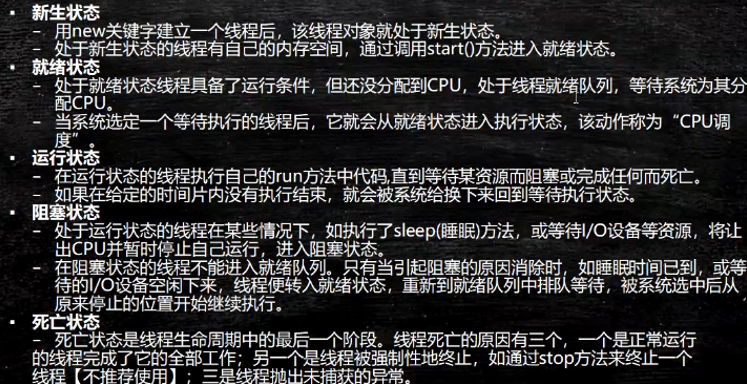
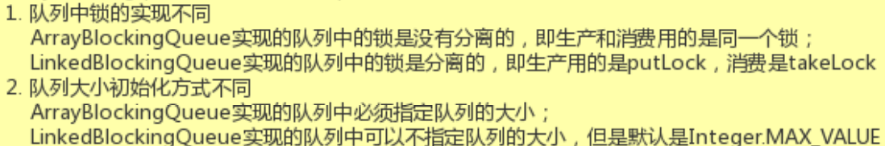

1. 程序(program)——进程(process)——线程(thread)

2. 实现多线程:

   - 第一种实现方式:
     - 需要继承Thread类
     - 必须要重写run方法, 指的是核心执行的逻辑
     - 线程在启动的时候, 不要直接调用run方法, 而是通过start()来进行调用
     - 每次运行相同的代码,  出来的结果可能不一样, 原因在于多线程谁先抢占资源无法进行认人为控制

   - 第二种实现方式(代理模式):
     - 实现Runnable接口
     - 重写run()方法
     - 创建Thread对象, 将刚刚创建好的runnable的子类实现作为Thread的构造参数
     - 通过thread对象.start()进行启动
   - 总结: 推荐使用第二种方式, Java是单继承, 将继承关系留给最需要的类

3. 使用Thread类实例化实现多线程时, 多个实例化的对象每一个在创建的时候都有成员变量的属性值, 意味着每一个类都有一个变量, 在开启当前线程之后每一个线程都会执行各自堆空间的属性

4. 静态成员变量归属于类, 不归属于对象, 使用runnable接口之后不需要给共享变量添加static关键字, 每次创建一个对象, 作为共享对象即可

5. 线程的状态

 

6. 线程的生命周期
   - 新生状态
     - 当线程创建好的对象之后, 没有启动之前(调用start方法之前)
   - 就绪状态
     - 准备开始执行但并没有执行, 表示调用start方法之后
     - 当对应的线程创建完成, 且调用start方法之后, 所有的线程废添加到一个就绪队列中, 所有的线程同时去抢占CPU的资源
   - 运行状态
     - 当前进程获取CPU资源之后, 就绪队列中的所有线程回去抢占CPU的资源, 谁先抢占到谁先执行, 在执行的过程中就叫做运行状态, 抢占到CPU资源,执行代码逻辑
   - 死亡状态
     - 当运行中的线程正常执行完所有的代码逻辑或者因为异常情况导致程序结束叫做死亡状态
   - 阻塞状态
     - 在程序运行的过程中, 发生某些异常情况, 导致当前线程无法再顺利执行下去, 此时会进入阻塞状态, 进入阻塞状态的原因消除之后, 所有的阻塞队列会再次进入到就绪状态中, 随机抢占CPU的资源,等待执行
     - 进入阻塞的方式
       - sleep方法
       - 等待IO资源
       - join方法(人为代码中的执行的逻辑)
7. 在多线程的时候, 可以实现唤醒和等待的过程, 但是唤醒和等待操作的对应不是thread类, 而是我们设置的共享对象或者共享变量
8. 多线程并发访问的时候会出现数据安全问题, 同步代码块synchronized(共享资源, 共享对象, 需要时object的子类) {具体执行的代码块}
9. 线程同步小结

 

10. 线程池的创建

```java
public ThreadPoolExecutor(int corePoolSize,	 	// 核心线程池的大小
                          int maximumPoolSize,  // 线程池能创建线程的最大个数
                          long keepAliveTime,	// 空闲线程存活时间
                          TimeUnit unit,		// 时间单位, 为keepAliveTime指定时间单位
                          BlockingQueue<Runnable> workQueue, // 阻塞队列, 用于保存任务的阻塞队列
                          ThreadFactory threadFactory, // 创建线程的工程类
                          RejectedExecutionHandler handler) // 饱和策略(拒绝策略)
```

11. ArrayBlockingQueue和LinkedBlockingQueue的区别



12. execute方法执行逻辑
    - 如果当前运行的线程少于corePoolSize, 则会创建新的线程来执行新的任务
    - 如果运行的线程个数等于或者大于corePoolSize, 则会将提交的任务存放到阻塞队列workQueue中
    - 如果当前workQueue队列已满的话, 则会创建新的线程来执行任务
    - 如果线程个数已经超过了maximunPoolSize, 则会使用饱和策略RejectedExecutionHandler来进行处理