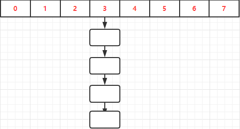
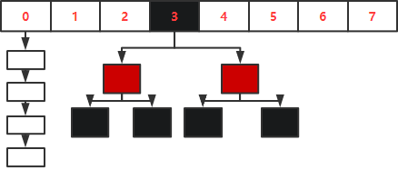
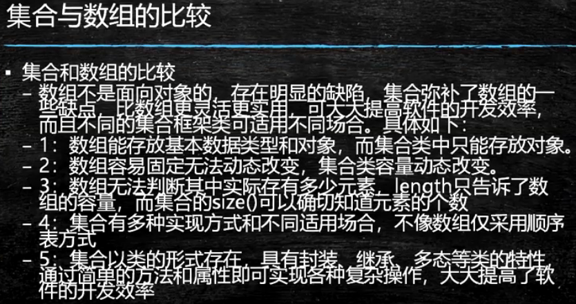
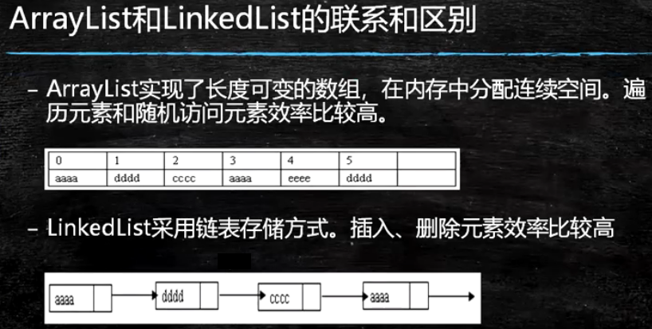
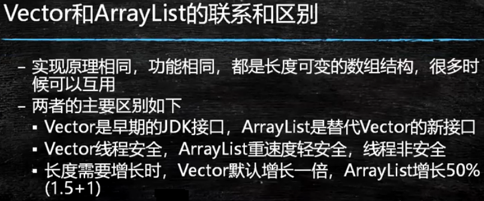

1. Map存储的是k-v键值对映射的数据
   - 实现子类
     - HashMap: 数组+链表(1.7)    数组+链表+红黑树(1.8)
     - LinkedHashMap: 链表
     - TreeMap: 红黑树

 

2. Map容器的常见API

```java
V put(K key, V value);	 // 添加k-v键值对元素
int size();			    // 获取map的大小
boolean isEmpty();       // 判断map是否为空
boolean containsKey(Object key);	// 判断是否包含key
boolean containsValue(Object Value);// 判断是否包含value
V get(Object key);		// 根据key获取value
V remove(Object key);    // 根据key删除value
void clear();			// 清空map
Set<K> keySet();		// 把map的key存到set集合中
Set<Map.Entry<K, V>> entrySet(); // k-v组合的一组映射关系存到set集合中
```

3. HashMap和HashTable的区别?
   - HashMap线程不安全, 但是效率比较高, HashTable线程安全, 但是效率低
   - HashMap中的key和value都可以为空, 但是HashTable不可以为空
   - HashTable类有synchronized关键字, HashMap没有

4. HashMap初始化为2的N次幂
   -  方便进行&操作, 提高效率, &要比取模运算效率要高; hash & (initCapacity - 1)
   - 在扩容之后设计到元素的迁移过程, 迁移的时候只需要判断二进制的前一位是0或者1即可, 如果是0表示新数组和旧数组的下标位置不变, 如果是1, 只需要将索引位置加上旧的数组长度值即为新数组的下标

5. JDK1.7HashMap原码知识点: 数组+链表
   - 默认初始化容量
   - 加载因子
   - put操作
     - 设置值, 计算hash
     - 扩容操作
     - 数据的迁移的过程

 

6. JDK1.8 数组+链表+红黑树

 

7. Collections工具类
   - 集合的操作类, 和Collection集合接口性质不一样
   - Colleciton工具类提供的静态方法

```java
public static <T> boolean addAll(Collection<? super T> c, T... elements) // 批量添加
public static <T extends Comparable<? super T>> void sort(List<T> list) // 排序
public static <T> int binarySearch(List<? extends Comparable<? super T>>list,T key)//二分查找
public static <T> void fill(List<? super T> list, T obj) // 替换
public static void shuffle(List<?> list) // 随机排序
public static void reverse(List<?> list) // 逆序
```

8. Arrays工具类

```java
public static <T> List<T> asList(T... a) // 把数组转换成集合, 这是工具类的静态方法
Object[] toArray(); // 集合转数组, 这是集合的方法
```

9. 面试题

 

 

 

 

 