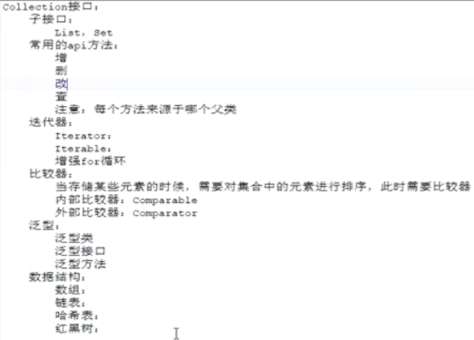

1. 高内聚，低耦合，简单说就是不要全写在main方法里，多个方法，每个方法都有自己独有的功能
2. 标识符必须以下划线,字母,美元符号组成.
3. 方法名使用小驼峰命名,类名和接口名称使用大驼峰,多个字母表示变量时使用大驼峰.
4. 整型常量默认为int，`''`单引号表示char，`""`双引号表示String类型，非常严格的定义
5. 简单来说static修饰的方法和变量不用new对象/实例化对象，可以直接拿来使用
6. super关键字的用法如下：
   - 使用格式 : super.变量名, super.方法名, super()
   - super只能出现在子类方法和构造方法中
   - super调用构造方法, 只能出现在第一句, 如果没有使用, 编译器会自动添加
   - super和this不能同时出现在构造方法中
- super不能访问父类的private成员
   - super和this不能在static静态方法中
7. 父类的静态方法子类可以调用，但是子类不能重写

8. 科学技术法:En/en表示10的n次方

9. private, static, final修饰的是编译时绑定，静态绑定；其它都是运行时绑定，动态绑定

10. 重载(Overloading) 是在一个类里面，方法名字相同，而参数不同。重写(Override)是子类对父类的允许访问的方法的实现过程进行重新编写, 返回值和形参都不能改变。**即外壳不变，核心重写！**

11. float: 单精度表示是用4个字节存储的, double:双精度时由8个字节存储的

12. 在类内方法外定义的变量是成员变量,存在默认值, 在方法内定义的必须进行初始化, 不会存在默认值

13. `&&`短路与:两边都为true才为true, `||`短路或两边有一个为true就为true

14. 位运算: `&`与表示都为1才为1, `|`或表示有一个为1就为1, `^`异或表示不相等为1, `~`按位取反

15. 三目运算符:(true或false)?值:值, 如果为true表示?后的值, 如果为false表示:后的值

16. 优先级: 单目>算数>关系>逻辑>三目>赋值

17. 负数二进制表示使用补码: 符号位不变, 其它为取反加1,  补码变原码取反加1

18. 流程控制: 顺序结构, 分支结构, 循环结构

19. Scanner sc = new Scanner(System.in) 实例化对象sc调用方法输出输入的值

20. while(){}先进性逻辑判断在执行代码块; do{}while()先执行代码块再逻辑判断

21. for(初始化1;条件表达式2;步进器3){代码逻辑4}，1243执行顺序, 然后顺着3开始324一致循环到2不成立

22. break表示跳出本层循环，适合Switch和循环结构；continue表示跳出本次循环，只能用于循环结构

23. 单个return相当于，System.exit(0)一样，退出

24. native关键字表示本地的意思，使用c语言和c++实现的程序，操作native调用本地操作系统的内核，unsafe包含很多native 的方法，底层的东西。

25. HashCode是int类型的，使用HashCode方法需要重写父类的HashCode方法

26. 递归必须包含两个部分：递归结束条件和递归体

27. notify()表示线程的唤醒，wait()表示线程的等待

28. finalize()判断当前对象是否有引用，如果没有引用，垃圾自动回收机制就会启动

29. 使用数组步骤：
    - 声明数组: 例如 int[] arr
    - 给定大小: 例如 arr = new int[4], 4就是数组的大小, 也可以12步一起写int[] arr = new int[4]
    - 赋值: 如果不是最初直接赋值，不给定大小，需要根据下标一个一个赋值
    - 数组操作: 数组定义的时候必须给定大小，且大小不可改变; 数组没有add和remove方法，因为数组长度是固定的，不能增加和减少
    
30. StringBuffer线程安全，效率低; StringBuilder线程不安全，效率高

    Collection接口有两个继承类List是有序的，Set是无序的。

 

31. List类有三个实现类ArrayList, LinkedList, Vector; ArrayList是数组方式存储的，线程不安全的，LinkedList是链表形式存储的，vector也是数组存储的，线程安全的，ArrayList进行扩容时是1.5倍，vector进行扩容时是2倍

32. Set类中有两个实现类HashSet和TreeSet，HashSet是使用哈希表存储的，无序的；TreeSet是采用红黑树存储的，有序的

33. 带有泛型的类或方法时第一次声明是占位符的作用，第二次继承或引用时是具体的类型

34. 进程作为资源分配的单位，线程作为调度和执行的单位

35. Collections是集合的操作类，Collection是集合接口，两者不一样

36. Map接口有HashMap实现类和TreeMap两个实现类，HashMap是无序的，HashMap的Key是唯一的（Set一样的性质）, Value是不唯一的; TreeMap是有序的，HashMap下面有个实现类是LinkedHashMap是有序的

37. HashMap在JDK1.7是数组+链表存储的，在1.8中是数组、链表+红黑树存储的