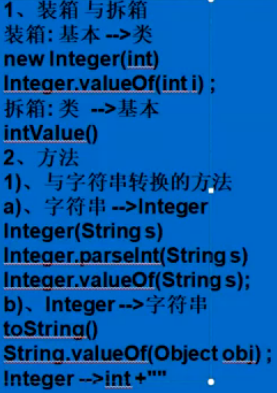
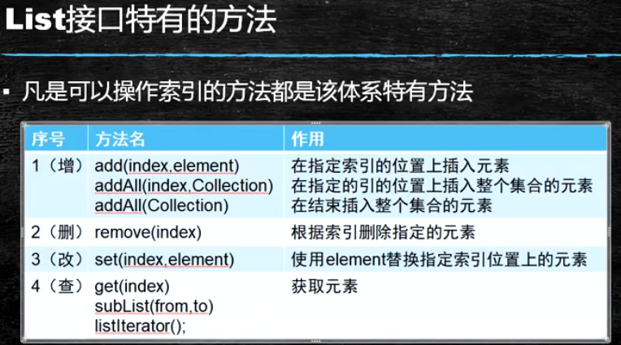
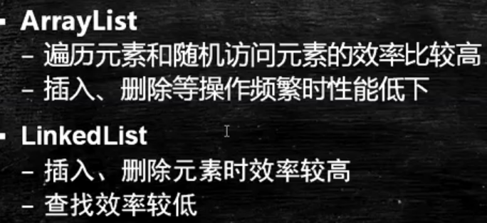
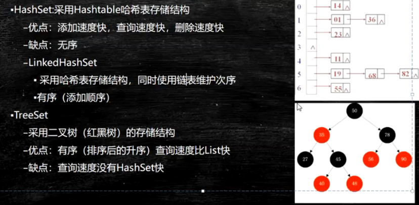
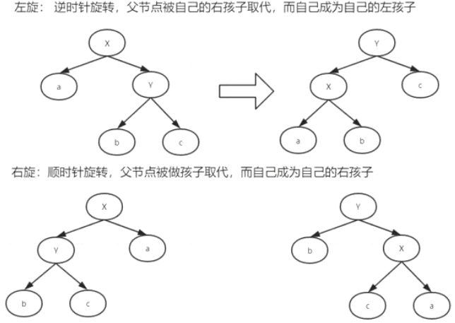

1. 五个常见运行时异常(RuntimeException)?
   - ClassCastException(类准换异常)
   - IndexOutOfBoundsException(数组越界)
   - NullPointerException(空指针)
   - ArrayStoreException(数据存储异常, 操作数组类型不一致时)
   - IllegalArgumentException(非法参数异常)

2. Java提供了两种异常机制。一种是运行时异常(RuntimeExepction)，一种是检查式异常(checked execption)

3. throw和throws的区别?

- throw是语句抛出的一个异常
- throws是方法可能抛出异常的声明

4. 如何自定义异常?

- 定义异常类
- 编写构造方法,继承父类的实现
- 实例化自定义异常对象
- 使用throw抛出

5. Integer转换

```java
public static Integer valueOf(int i) {
    if (i >= IntegerCache.low && i <= IntegerCache.high)   // 如果 -128 < i < 127
        return IntegerCache.cache[i + (-IntegerCache.low)];// 返回一个Cache数组,这个cahe数组的目的是减少内存的使用
    return new Integer(i);								// 否则,返回一个对象
}
```

6. 自动装箱和自动拆箱

- 自动装箱
  - 基本类型就自动地封装到它相同类型的包装中,如:Integer i = 100; 本质上, 编译器编译时为我们添加了 Integer i = Integer.valueOf(100);

- 自动拆箱
  - 包装类对象自动转换成基本数据类型, 如: int a = new Integer(100); 本质上, 编译器为我们添加了 Int a = new Integer(100).intValue();

 

7. 常量池1.7之后放置在了堆空间之中

8. ```java
   String s1 = "String"; // 这种方式，java首先会在缓冲区查找是否有"String"这个常量对象，有就直接将其地址赋给s1，没有就创建一个"String"，然后将其赋给s1
   String s2 = "String"; // java同样会在缓冲区中查找"String"，这次能查找到了，因为s1创建了一个"String",所以会将其地址赋给s2
   //如此，s1和s2便有了相同的地址
   
   String s3 = new String("String"); // 会直接在内存中开辟一个空间存储一个"String"，并讲引用赋给s3；
   String s4 = new String("String"); // 也会开辟一个空间，并将引用赋给s4；
   // 所以s3和s4的地址不一样。
   ```

9. ```java
   public String substring(int beginIndex, int endIndex) // 截取字符串
   public String concat(String str) // 数组的拼接
   public String trim() // 去除两边空格
   public int indexOf(int ch) / public int indexOf(String str) // 查找字符或者字符串的首次出现的下标
   public int lastIndexOf(int ch) / public int lastIndexOf(String str) // 查找字符或者字符串的最后一次出现的下标
   public native String intern() // When the intern method is invoked, if the pool already contains a string equal to this object as determined by the method, then the string from the pool is returned. Otherwise, this object is added to the pool and a reference to this object is returned.当调用intern方法时，如果常量池中已经包含了由方法确定的与该对象相等的字符串，则返回池中的字符串。否则，将该对象添加到池中，并返回对该对象的引用
   ```

10. ```java
    String a = "abc";
    String b = "def";
    String c = a + b;			// 这里a, b只知道它是一个字符串对象, 不知道a和b是字符串
    String d = "abc" + "def";    // 这是是d直到了常量池中的值, 然后指向了常量池中abcdef的地址
    String e = (a + b).intern(); // 这里同过intern方法找到了字符串常量池中的地址
    System.out.println(c == d);  // false
    System.out.println(d == e);  // true
    ```

11. **字符串不可变, 真正解释是里面final修饰的char[] 数组的引用不可变, 而并不是数组里的值不可变**

12. ```java
    SimpleDateFormat sdf = new SimpleDateFormat("yyyy-MM-dd HH:mm:ss"); // 转换格式
    public final String format(Date date) // 将日期类转换为对应的字符串
    public Date parse(String source) // 将字符串转换为对应的日期内, 需要转换异常ParseException
    ```

13. Collection: 存放的是单一值

    - 特点
      1. 可以存放不同类型的数据, 而数组只能存放固定类型的数据
      2. 当使用arraylist子类实现的时候, 初始化的长度是10, 当长度不够的时候会自动进行扩容操作

14. Collection接口存储一组**不唯一**, **无序**的对象
    - List接口存储一组**不唯一**, **有序(插入顺序)**的对象
    -  
    -  
    - Set接口存储一组**唯一**, **无序**的对象, Set接口不存在get()方法
    -  

15. Map接口存储一组**键值对**, 提供key到value的映射

16. length——数组的属性

    length()——String的方法

    size()——集合的方法

17. ```java
    // Iteartor迭代器遍历, 实现了Iterator接口, 就可以使用Iteartor迭代器遍历
    Iterator iterator = list.iterator();
    while (iterator.hasNext()) {
        System.out.print(iterator.next() + " ");
    }
    
    // 增强for循环, for-each, 实现了Iterable接口, 就可以使用for-each增强for循环遍历
    for (String str : list) {
        System.out.print(str + " ");
    }
    ```

18. 为什么集合容器Collection接口和它的子类或子接口实现Itearable接口而不是实现Iteartor呢?

    - 因为Iterator接口的核心方法next()或者hasNext() 是**依赖于迭代器的当前迭代位置**的。 如果Collection直接实现Iterator接口，势必导致集合对象中包含当前迭代位置的数据(指针)。 当集合在不同方法间被传递时，由于当前迭代位置不可预置，那么next()方法的结果会变成不可预知。而Iterable则不然，每次调用都会返回一个从头开始计数的迭代器。 多个迭代器是互不干扰的, Iterable的for-each本质是通过Iteartor迭代器实现的

19. 使用iterator进行迭代的过程中如果删除其中某个元素会报错, 并发生操作异常, 因此如果遍历的同时需要修改元素, 建议使用listIterator()
20. ListIterator迭代器提供了向前和向后两种遍历的方式

```java
// 始终通过cursor和lastret的指针来获取元素值以及向下的遍历索引
ListIterator iterator = list.listIterator();
while (iterator1.hasNext()) {
    System.out.print(iterator.next() + " ");
}
// 当使用向前遍历的时候必须保证指针在迭代器的结尾, 否则无法获取结果值
while (iterator1.hasPrevious()) {
    System.out.print(iterator.previous() + " ");
}
```

21. Hash表的原理?
    
- 一组数字,对应的hash算法产生的hashcode然后模上数组的长度, 把对应的值放在取的模位置上
  
22. ```java
    // 迭代器对象
    Iterator iterator = set.iterator(); // iterator的作用域对象是从定义了这个迭代器开始直到方法体结束, 如果后面一直有代码, 这个对象永远都不会回收
    // 使用while循环遍历
    while (iterator.hasNext()) {
        System.out.print(iterator.next() + " ");
    }
    // 使用for循环遍历 推荐使用
    for (Iterator iterator1 = set.iterator(); iterator.hasNext(); ) {
        System.out.print(iterator1.next() + " ");
    }
    // 总结: 使用for循环遍历比while循环遍历好, 因为while循环遍历初始化在方法体内,如果方法体未结束, iterator一直不回收; 如果定义在for循环中, 作用域直在for循环内, 当你的for循环结束后, iterator对象就被回收掉了
    ```

23. AVL Tree(平衡二叉树), 通过左旋和右旋保证二叉搜索树的平衡,左边的子树和右边的子树他们的层次不能超过1

    -  

24. Red-Black Tree(红黑树)是一种平衡二叉查找树, Java中用到树的地方大部分都是红黑树,因为保持了平衡的特点, 还有它的性能, 特点如下:
    - 节点是红色或黑色
    - 根节点是黑色
    - 每个叶子节点(NULL)节点是黑色的
    - 每个红色节点的两个子节点都为黑色, 从每个叶子到根的所有路径上不能有两个连续的红色节点
    - 从任一节点到其每个叶子的所有路径都包含相同数目的黑色节点
    - 最长路径不超过最短路径的2倍

25. equals()既然已经能实现对比的功能了，为什么还要hashCode()呢？
    - 因为重写的equals（）里一般比较的比较全面比较复杂，这样效率就比较低，而利用hashCode()进行对比，则只要生成一个hash值进行比较就可以了，效率很高
    - 先比较hashcode再比较equals
    - 如果元素的hashcode值相同, 才会判断equals是否为true
    - 如果元素的hashcode值不同, 不会调用equals方法
    - **equals()相等的两个对象他们的hashCode()肯定相等，也就是用equals()对比是绝对可靠的**
    - **hashCode()相等的两个对象他们的equals()不一定相等，也就是hashCode()不是绝对可靠的**

26. 比较器:

```java
// 外部比较器
public class TestTreeSet implements Comparator<Person> {
    TreeSet treeSet = new TreeSet(new TestSet());
    @Override
    public int compare(Person o1, Person o2) {
        if (o1.getAge() > o2.getAge()) {
            return 1;
        } else if (o1.getAge() < o2.getAge()) {
            return -1;
        } else { // 这是判断条件是相等返回0, 是不会把元素集合给加到TreeSet集合中的, 等于说完成了去重功能, 有了compare()方法以后就不会调用equals()方法
            return 0;
        }
    }
}

// 内部比较器
public class Person implements Comparable {
    @Override
    public int compareTo(Object o) {
        // 转换类型
        Person p = (Person)o;
        // 实现比较器
        if (p.name.length() > this.name.length()) {
            return -1;
        } else if (p.name.length() < this.name.length()) {
            return 1;
        } else { // 这是判断条件是相等返回0, 是不会把元素集合给加到TreeSet集合中的, 等于说完成了去重功能, 有了compareTo()方法以后就不会调用equals()方法
            return 0;
        }
    }
}
// 总结: 外部比较器可以定义成一个工具类, 此时所有需要比较的规则如果一致的话, 可以复用; 而内部比较器只有在存储当前对象的是否才可以使用; 如果两者同时使用, 外部比较器生效
```

27. 泛型(E: element; K: key; V: value)

```java
ArrayList<String> list = new ArrayList<String>();
// list.add(1); 相当于list.add(new Integer(1));
// list.add(true); 相当于list.add(new Boolean(true));
list.add("String"); // 相当于list.add(new String("String"));
list.add(new Person("zss", 12).toString());
// 使用for循环遍历集合
for (int i = 0; i < list.size(); i++) {
    System.out.print(list.get(i) + " "); // 使用get()方法打印输出
}
// 使用增强for循环遍历集合
for (String l : list) {
    System.out.print(l + " ");
```

28. TreeSet使用: 必须实现比较器, 如果是外部比较器, 得在new Tree()小括号里填上自己外部构造器的类的实例化

