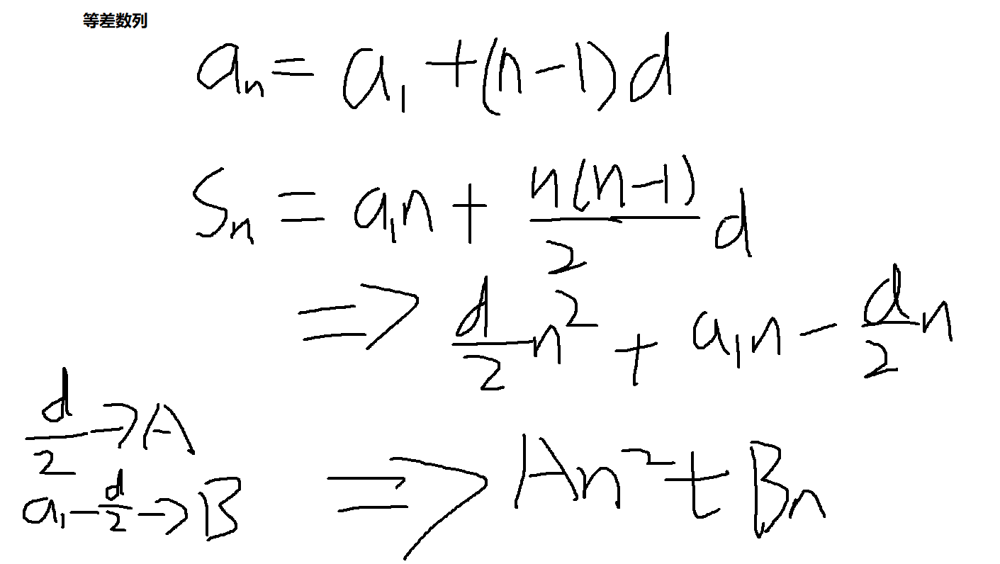

1. 时间复杂度：把算法流程的每一步操作都分解成常数时间的
2. 等差数列变换公式
 
3. `>>`带符号为右移，`>>>`不带符号位右移，左移同样
4. 单链表的get(i)操作，每次从0开始找到i的操作，是O(n)的时间复杂度
5. 给定的变量和形参不算额外空间复杂度，也就是说输入参数和输出结果的空间不算额外空间
6. 最优解就是讨论时间复杂度和空间复杂度
7. 复杂度从好到坏

   - O(1)---O(logN)---O(N)---O(N*logN)---O(N<sup>2</sup>)---O(N<sup>3</sup>)---O(N<sup>k</sup>)---O(2<SUP>N</sup>)---O(3<SUP>N</sup>)---O(K<SUP>N</sup>)---O(N!) 
8. 估计时间复杂度的时候用最差情况来估计
9. lnN是以e为底,  lgN是以10, logN是以2为底
10. 计算机除法时想下取整的5/2整数型是2
11. 对数器

```java
package com.java.algorithm.practice.class01;

import java.util.Arrays;

/**
 * Readme: 在30行填入自己排序的方法
 * 
 * 
 * @Author: PeiYiDing
 * @Date: 2020/12/29
 * @Description: com.java.algorithm.practice.class01
 */
public class RandomDemo {
    // main
    public static void main(String[] args) {
        // 定义测试次数
        int testTime = 5000;
        // 定义数组大小范围
        int maxSize = 400;
        // 定义数组值的范围
        int maxValue = 342;
        // 定义一个布尔值, true
        boolean succeed = true;

        // 循环测试
        for (int i = 0; i < testTime; i++) {
            // 生成一个随机数组
            int[] arr1 = generateRandomArray(maxSize, maxValue);
            // 赋值随机数组
            int[] arr2 = copyArray(arr1);
            // 自己的排序

            // 比较器
            Arrays.sort(arr2);
            // 如果两个数组不相等
            if (!isEqual(arr1, arr2)) {
                // 给标记值赋值false
                succeed = false;
                // 退出
                break;
            }
        }
        // 打印结果
        System.out.println(succeed ? "Nice!" : "Fucking fucked!");
    }

    // for test
    public static int[] generateRandomArray(int maxSize, int maxValue) {
        // 指定数组的长度
        int[] arr = new int[(int) ((maxSize + 1) * Math.random())];
        // 循环遍历数组
        for (int i = 0; i < arr.length; i++) {
            // 指定数组的值
            arr[i] = (int) ((maxValue + 1) * Math.random()) - (int) (maxValue * Math.random());
        }
        // 返回数组
        return arr;
    }

    // 拷贝数组
    public static int[] copyArray(int[] arr) {
        // 判断如果数组等于空
        if (arr == null) {
            // 返回空值
            return null;
        }
        // 定义一个新数组, 数组长度等于传进来的数组的长度
        int[] res = new int[arr.length];
        // 循环遍历
        for (int i = 0; i < arr.length; i++) {
            // 拷贝数组
            arr[i] = res[i];
        }
        // 返回拷贝过的数组
        return res;
    }

    // 比较数组是否相等
    public static boolean isEqual(int[] arr1, int[] arr2) {
        // 判断如果有一个为空, 另一个不为空就为false
        if ((arr1 == null && arr2 != null) || (arr1 != null && arr2 == null)) {
            return false;
        }
        // 判断如果如果都为空, 返回true
        if (arr1 == null && arr2 == null) {
            return true;
        }
        // 判读如果长度不等, 返回false
        if (arr1.length != arr2.length) {
            return false;
        }
        // 循环遍历判断每一个值是否相等
        for (int i = 0; i < arr1.length; i++) {
            if (arr1[i] != arr2[i]) {
                return false;
            }
        }
        // 如果以上条件都不满足, 返回true
        return true;
    }
}
```

12. 异或运算: 0 ^ N = N, N ^ N = 0 
13. 求一个数二进制最右边为1的结果: N & ((~N) + 1)